## 项目概述

**ZYYMusic** 是一个基于 **Qt/QML** 开发的音乐播放器桌面应用程序，采用现代化的 UI 设计，模仿网易云音乐的风格。

## 技术栈

- **框架**: Qt 6.5.3
- **UI 技术**: Qt Quick + Qt Quick Controls 2
- **语言**: C++ (后端) + QML (前端)
- **平台**: macOS（支持跨平台）

## 核心功能模块

### 1. 主窗口布局 ([main.qml](https://github.com/suny-nice/ZYYMusic/blob/main/main.qml))

采用经典的三栏布局：

- **左侧导航栏**: 功能菜单导航
- **右侧内容区**: 展示音乐内容
- **底部播放栏**: 播放控制、进度、音量等

### 2. 左侧面板 ([LeftPage.qml](https://github.com/suny-nice/ZYYMusic/blob/main/Src/leftPage/LeftPage.qml))

包含主要功能入口：

- 网易云音乐
- 本地音乐
- 最近播放
- 我的博客
- 社区

### 3. 右侧面板 ([RightPage.qml](https://github.com/suny-nice/ZYYMusic/blob/main/Src/rightPage/RightPage.qml))

#### 网易云音乐精选模块

- **轮播图** ([Carousellmage.qml](https://github.com/suny-nice/ZYYMusic/blob/main/Src/rightPage/cloudMusicCherryPick/Carousellmage.qml)): 自动轮播推荐内容
- **新歌** ([NewSing.qml](https://github.com/suny-nice/ZYYMusic/blob/main/Src/rightPage/cloudMusicCherryPick/NewSing.qml)): 最新音乐推荐
- **榜单** ([Ranking.qml](https://github.com/suny-nice/ZYYMusic/blob/main/Src/rightPage/cloudMusicCherryPick/Ranking.qml)): 各类音乐排行榜
- **歌单广场** ([SongListSquare.qml](https://github.com/suny-nice/ZYYMusic/blob/main/Src/rightPage/cloudMusicCherryPick/SongListSquare.qml)): 精选歌单
- **官方歌单** ([OfficialPlayList.qml](https://github.com/suny-nice/ZYYMusic/blob/main/Src/rightPage/cloudMusicCherryPick/OfficialPlayList.qml)): 官方推荐歌单

#### 设置页面堆栈

- 关于、账户、播放设置
- 桌面歌词、消息与隐私
- 音质与下载、系统设置
- 自定义快捷键、工具等

### 4. 底部播放栏 ([PlayMusic.qml](https://github.com/suny-nice/ZYYMusic/blob/main/Src/bottomPage/PlayMusic.qml))

音乐播放控制功能：

- 播放/暂停、上一首/下一首
- 播放模式切换（顺序、随机、单曲循环）
- 音量控制、静音
- 歌词显示、收藏、分享

### 5. 顶部标题栏 ([TopTitle.qml](https://github.com/suny-nice/ZYYMusic/blob/main/Src/rightPage/TopTitle.qml))

- 搜索功能 ([Search.qml](https://github.com/suny-nice/ZYYMusic/blob/main/Src/topTitle/Search.qml))
- 用户登录 ([UserLogin.qml](https://github.com/suny-nice/ZYYMusic/blob/main/Src/topTitle/UserLogin.qml))
- 窗口控制 ([MaxMin.qml](https://github.com/suny-nice/ZYYMusic/blob/main/Src/topTitle/MaxMin.qml))
- 主题换肤 ([ColorSelectPopup.qml](https://github.com/suny-nice/ZYYMusic/blob/main/Src/topTitle/ColorSelectPopup.qml))

## 通用UI组件

项目封装了多个可复用组件：

- [ZYYWindow.qml](https://github.com/suny-nice/ZYYMusic/blob/main/Src/commonUI/ZYYWindow.qml): 自定义窗口
- [ZYYCheckbox.qml](https://github.com/suny-nice/ZYYMusic/blob/main/Src/commonUI/ZYYCheckbox.qml): 复选框
- [ZYYComboBox.qml](https://github.com/suny-nice/ZYYMusic/blob/main/Src/commonUI/ZYYComboBox.qml): 下拉框
- [ZYYRadioButton.qml](https://github.com/suny-nice/ZYYMusic/blob/main/Src/commonUI/ZYYRadioButton.qml): 单选按钮
- [ZYYShortcut.qml](https://github.com/suny-nice/ZYYMusic/blob/main/Src/commonUI/ZYYShortcut.qml): 快捷键
- [ZYYCutLine.qml](https://github.com/suny-nice/ZYYMusic/blob/main/Src/commonUI/ZYYCutLine.qml): 分割线

## 特色功能

1. **流畅的轮播动画**: 使用 QML 属性绑定和动画系统实现
2. **主题换肤**: 支持多种颜色主题切换
3. **桌面歌词**: 可选的桌面歌词显示功能
4. **快捷键支持**: 自定义播放控制快捷键
5. **多平台登录**: 支持微信、QQ、微博、手机号登录

## 项目实际界面

### 1.精选歌单

#### 1.1轮播图

通过获取第一张图添加到最后，在删除第一张实现轮播图效果

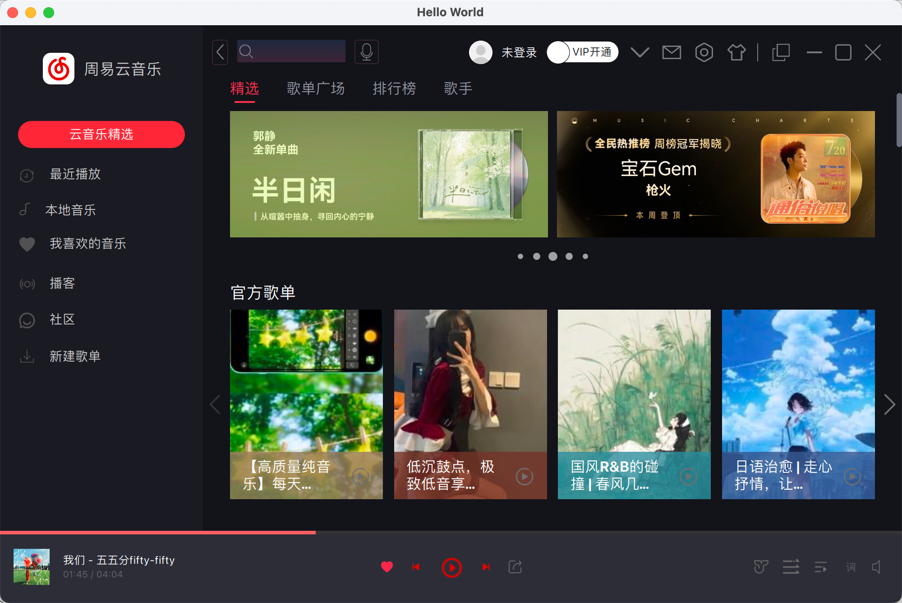

鼠标移入，出现左右箭头，点击左右箭头会调用slideLeft()和slideRight()实现左滑和右滑，自动向左滑动通过定时器，另外动画效果主要是  remove: Transition 和 removeDisplaced: Transition 过渡；下面圆形指示器的尺寸按照[0, 6, 8, 10, 8, 6, 0]，把图片滑动和指示器流动放在同一个函数里实现同步移动

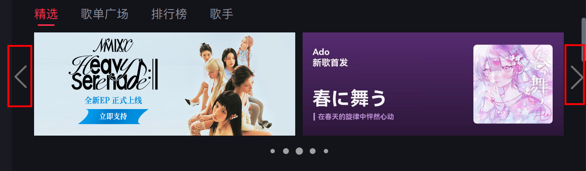

#### 1.2官方歌单

```
┌─────────────────────────────┐
│  Rectangle (卡片容器)        │
│  ┌───────────────────────┐  │
│  │  Image (背景图片)      │  │
│  │                       │  │
│  │                       │  │
│  │  ┌─────────────────┐  │  │
│  │  │ Rectangle (渐变) │  │  │
│  │  │ ┌─────────────┐ │  │  │
│  │  │ │ 文本内容     ｜｜  │  │
│  │  │ └─────────────┘ │  │  │
│  │  └─────────────────┘  │  │
│  │              [播放]    │  │
│  └───────────────────────┘  │
└─────────────────────────────┘
```

鼠标移入Item里内容向上弹


#### 1.3最新音乐

只显示六个可以通过左右箭头选择，主要是通过网格布局

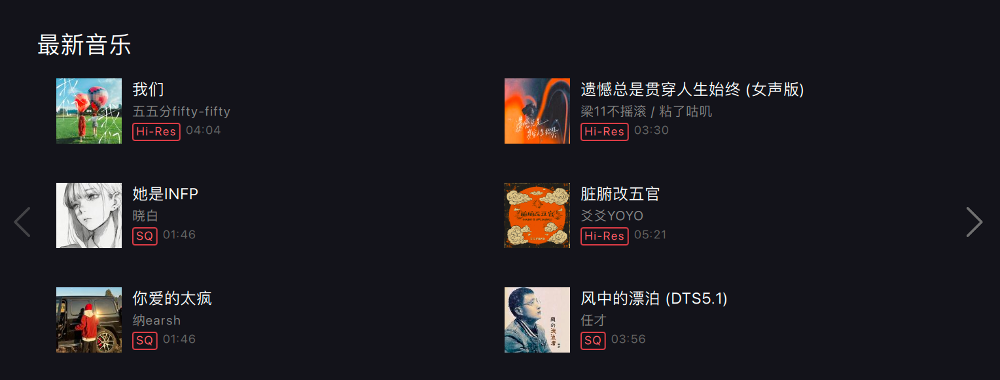

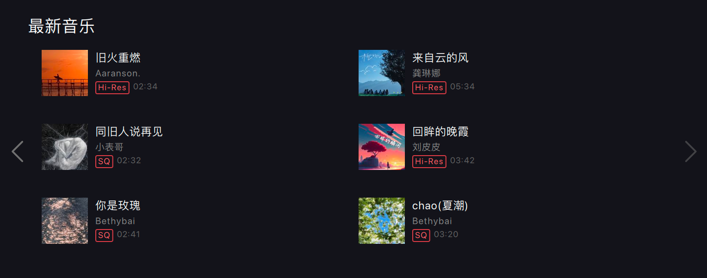

#### 1.4压栈出栈

另外通过pop和push把弹出的StackView存到列表里，点击左箭头在实现返回

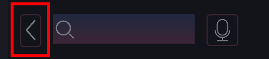

### 2.搜索框

搜索内容大于6会出现“ < ”折叠内容，点击清除图标会清理掉所有内容，Flickable滚动区域根据内容大小所定，另外每次新的搜索内容都是第一个

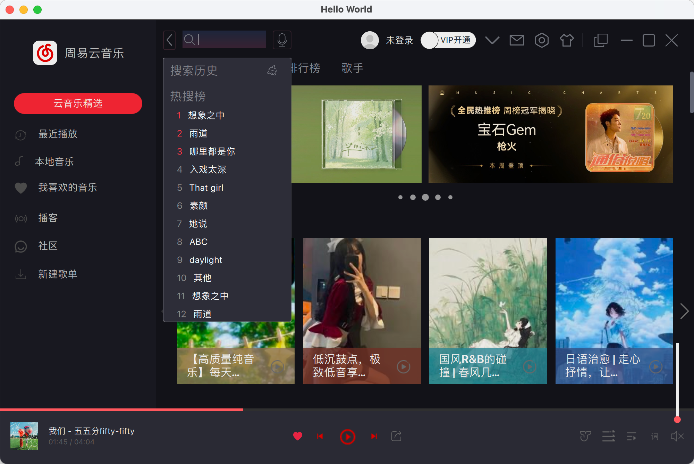

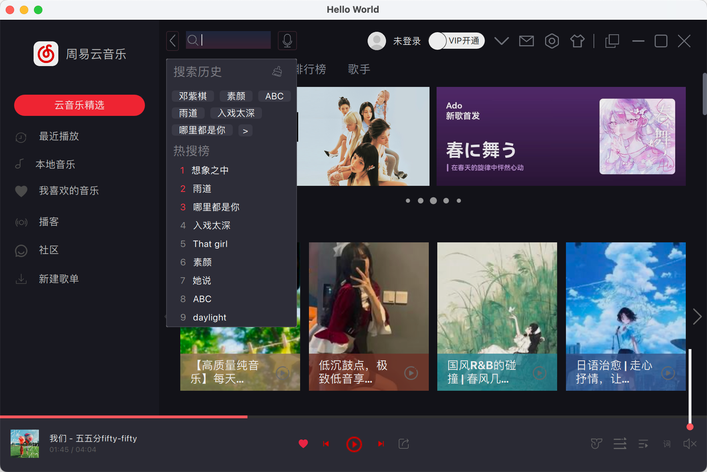

### 3.登录界面

点击“未登录”

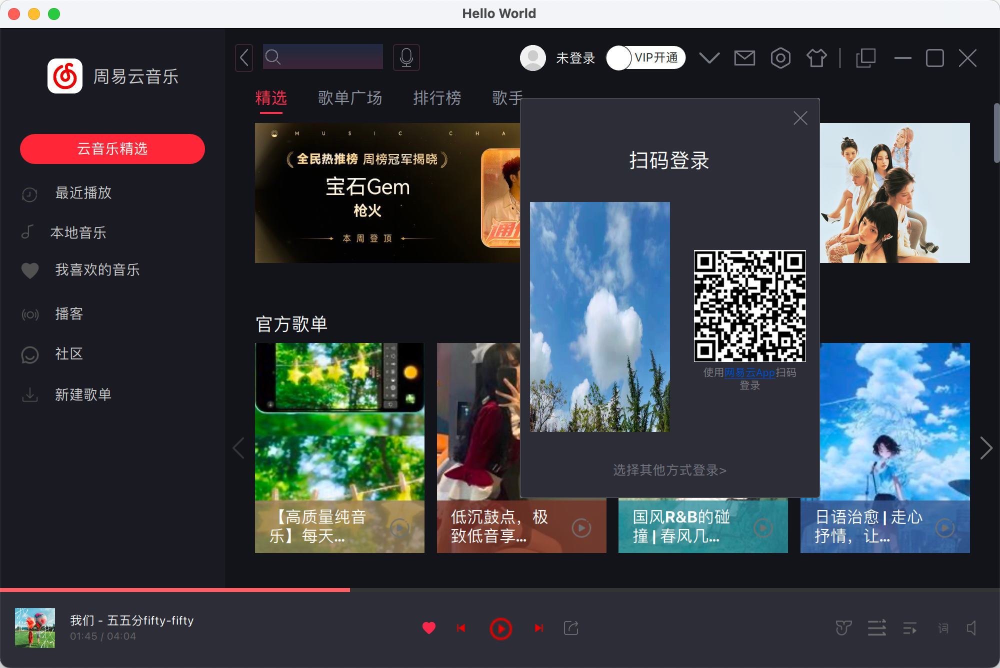

鼠标移入二维码在中间显示，另一张图消失；点击“网易云App”会打开网易云官方网站

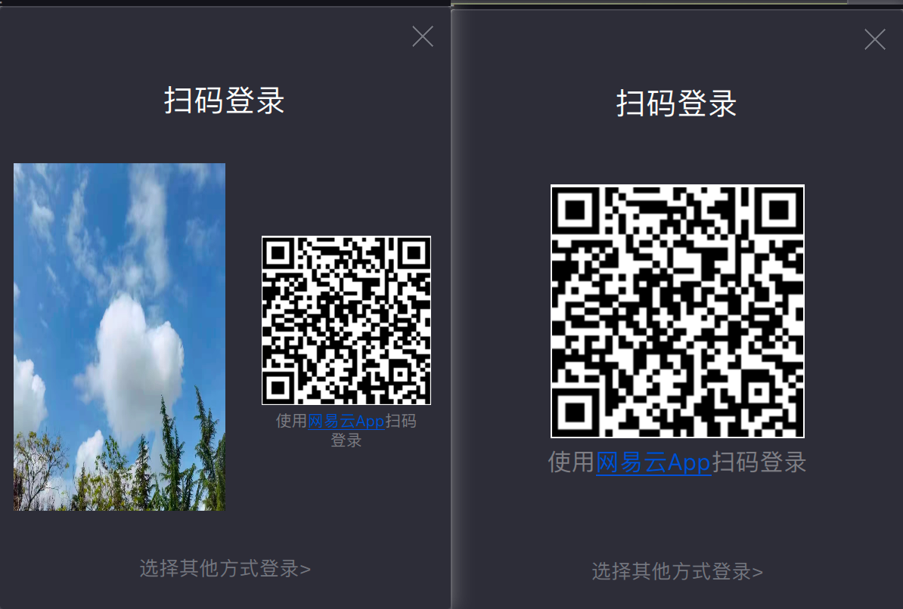

点击“ 其他方式登录> " 出现界面：点击左上角二维码返回上一个弹窗内容，另外点击国旗+标识会出现弹窗

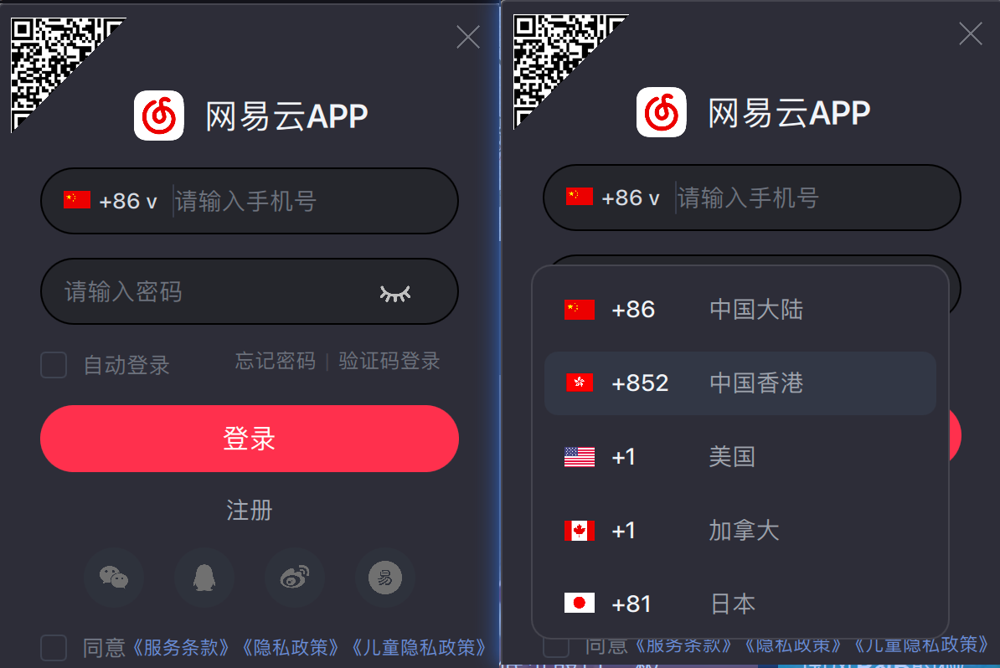

### 4.设置

点击设置图标：有十个导航栏，点击对应的导航栏会跳转到对应内容

这里自定义了下拉框、单选框、复选框、快捷键、文件选择

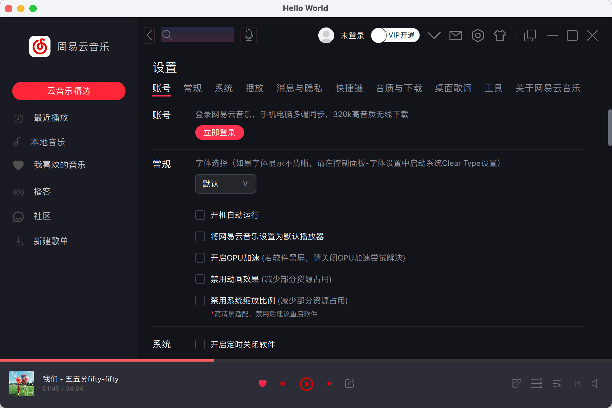

#### 4.1常规

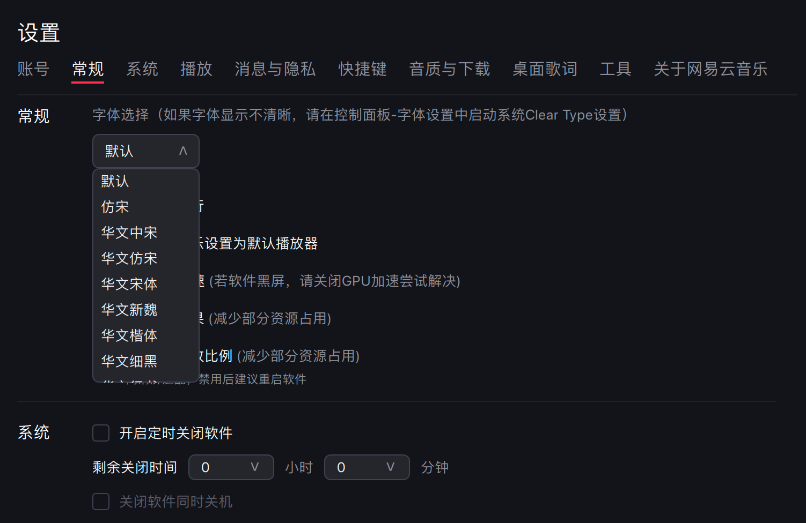

#### 4.2快捷键

固定⌘、⌥、⌃三个键从而监听其他键，通过event.modifiers & Qt.MetaModifier实现三个键

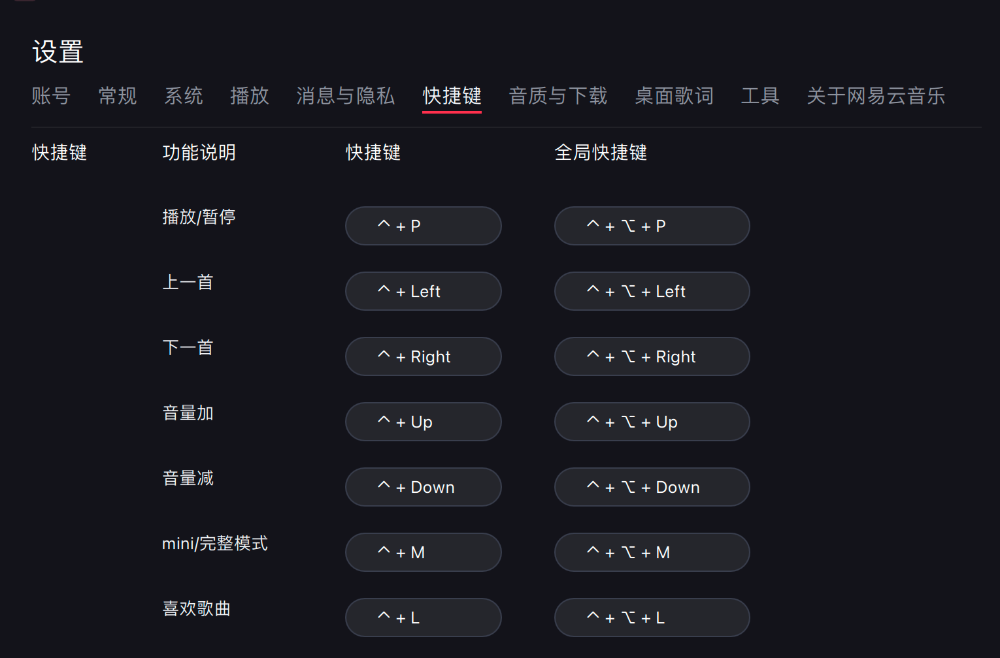

另外还有一个默认恢复按钮，恢复原来的快捷键


#### 4.3音质与下载

点击“更改目录”会出现文件选择弹窗，目录过长会中间省略，另外点击清除缓存会出现Toast提示

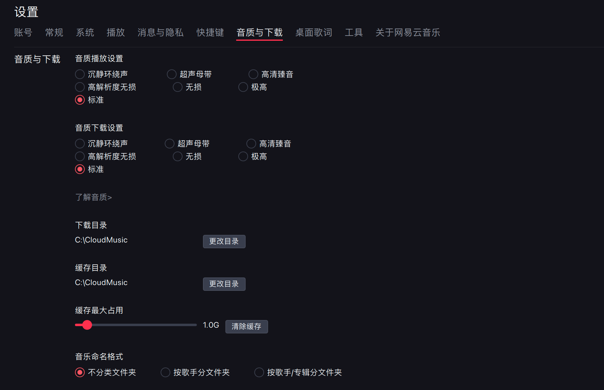

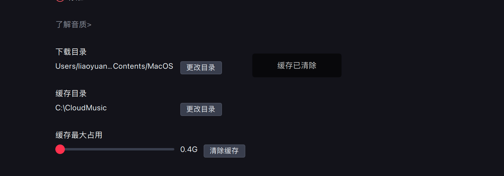

#### 4.4歌词桌面

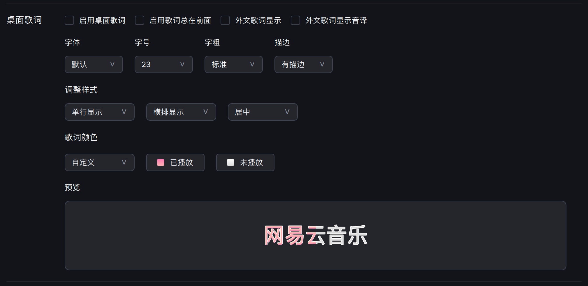

通过点击“已播放”和“未播放”里的“渐变上”、“渐变下”、“描边”来实现预览的改变

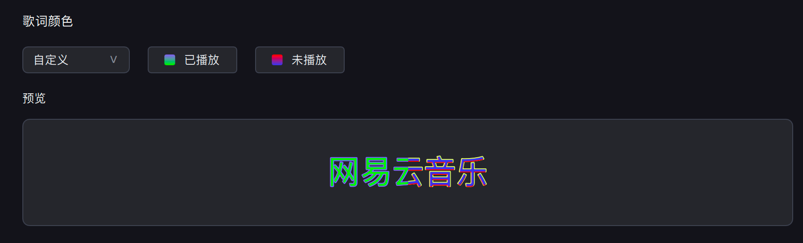

另外最左端的大矩形、已/未播放和预览里三者颜色一致，颜色一致性通过 [BasicConfig.qml](https://github.com/suny-nice/ZYYMusic/blob/main/Src/basic/BasicConfig.qml) 中定义的**全局颜色属性**实现。


### 5.播放栏

